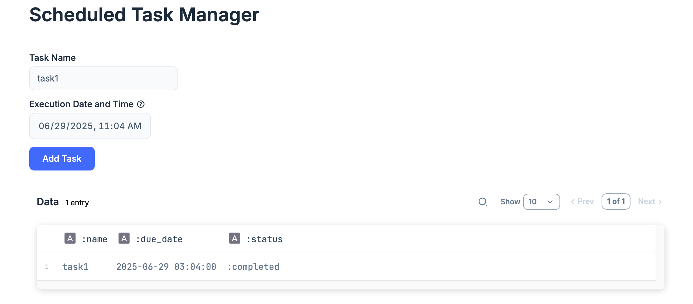

# Task Manager

## Description
This project is a LiveBook application designed to manage asynchronous tasks efficiently. It provides a user-friendly interface to monitor and control various background processes.

## Features
- **Task Monitoring**: Keep track of all running and scheduled tasks.
- **Task Management**: Start, stop, and restart tasks as needed.
- **Live Updates**: Real-time updates on task status and progress.
- **User-Friendly Interface**: Intuitive design for easy navigation and task interaction.

## Screenshot



This screenshot shows the main interface of the Task Manager application, demonstrating its clean layout and how tasks are displayed.

## Installation
To set up the Task Manager application, follow these steps:

1.  **Clone the repository**:
    ```bash
    git clone https://github.com/your-username/task_manager.git
    cd task_manager
    ```

2.  **Install dependencies**:
    (Assuming you have Elixir and Livebook installed)
    ```bash
    # Add any specific Elixir/Livebook dependency installation steps here if necessary
    ```

3.  **Open in Livebook**:
    Open the `task_scheduler.livemd` file in your Livebook environment.

## Usage
Once opened in Livebook, you can run the cells to start the task manager. Follow the instructions within the Livebook notebook to interact with the application and manage your asynchronous tasks.

## Contributing
Contributions are welcome! Please feel free to submit a pull request or open an issue if you find any bugs or have suggestions for new features.
